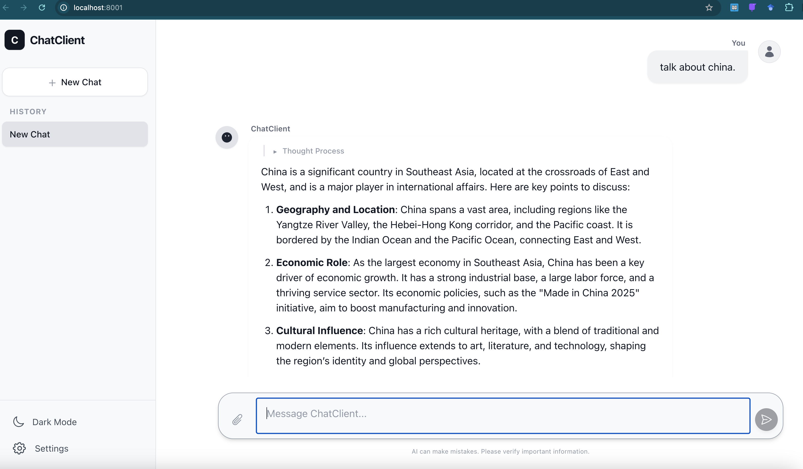

# 📦 `Rust Chat UI`

A small Rust library + binary that serves a pre-built web UI (for example, a Vite/TypeScript `dist/` folder).

It can be used:

* **as a library** inside another Rust server (spawned conditionally)
* **as a standalone binary** (run directly from CLI)

This crate is ideal if you want a reusable, embeddable UI server.

💡This crate is a Rust wrapper for the **release build** of `chatclient` (co-developed with Gemini): [https://github.com/guoqingbao/chatclient](https://github.com/guoqingbao/chatclient)

---

## ✨ Features

* Serves any static frontend from a `dist/` folder (Vite, React, Svelte, Solid, etc.)
* Simple public API (`start_ui_server(port, path)`)
* Run standalone via:

  ```bash
  cargo run --release --bin chatui --ui-port 8080 --api-port 8000
  ```
* Async, non-blocking Axum server
* Works well alongside other Axum/Tokio servers

# ⚡ Install and use globally:

```bash
cargo install --path .
# Use local API server
chatui --ui-port 8080 --api-port 8000
# Use remote API server
chatui --ui-port 8080 --server-url http://api.openai.com/v1 --api-key xxxxx
```
---

# 🚀 Usage as a Standalone Binary

This crate includes a `main.rs`, so you can run the server directly.

### Run on port (8080) and communicate with local (port 8000) API server:

```bash
cargo run --release --bin chatui -- --ui-port 8080 --api-port 8000
```

### Run on port (8080) and communicate with remote API server:

```bash
cargo run --release --bin chatui -- --ui-port 8080 --server-url http://api.openai.com/v1 --api-key xxxxx
```

---

## ✨🖥️ Built-in ChatGPT-like UI Features

- 🌞 **Light Mode**  
- 🌙 **Dark Mode**  
- ⚡ **Fluent Response**  
- 🎞️ **Animations**  
- 🧠 **Thinking Process** *(embedded)*  
- 🗂️ **Chat History Storage**  
- 📈 **Token Usage Indicator**

- ⚙️ **Settings Panel**:
  > 🔑 OpenAI API Compatible Server URL / Key  
  > 🎛️ Sampling Parameters  
  > 🗄️ Context Cache  
  > 📝 Auto Title Generation

---


